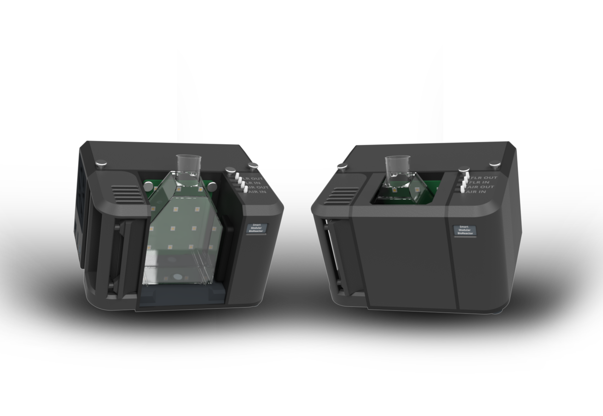
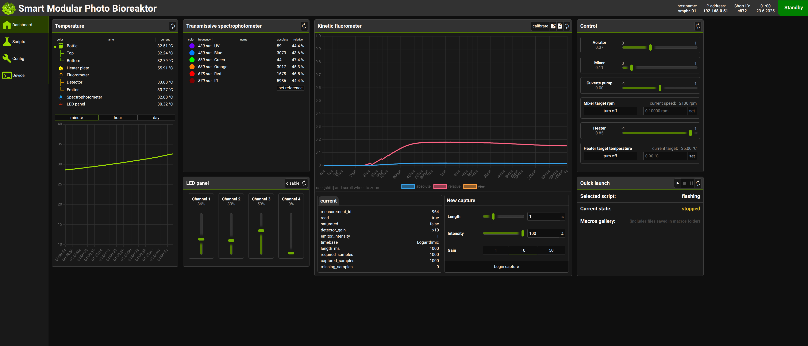
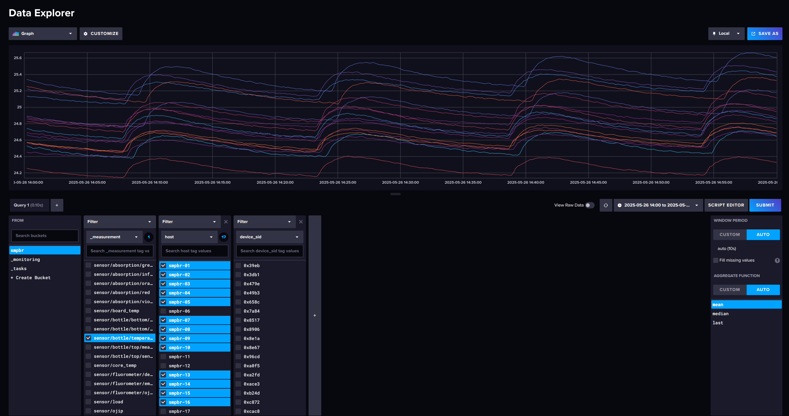

# SmartModularPhotoBioReactor (SMPBR)
The smart bioreactor offers a modern solution for [algae cultivation](https://en.wikipedia.org/wiki/Algaculture). With its modular design, open-source technology, and open API, it is an ideal tool for educational purposes and research. A practically unlimited number of modules can be added to the system via the CAN bus and accessed via an open REST-API. The goal is to achieve maximum adaptability and scalability to enable smart distributed optimization in multi-parameter systems.

## Main Features
- Dimensions of the entire device: **20 x 16 x 20 cm** (H x W x D).

- The lighting module enables illumination with red (625 nm), green (435 nm), blue (475 nm), and white (2800 K) light, or any wavelength as required by the experiment. Can deliver up to 20W of illumination per 100cm^2.
- Temperature control: **-10°C to +20°C** relative to ambient temperature.
- The measurement module performs absorbance measurements of optical density at six defined wavelengths.
- The temperature of the algae mixture is measured by contact-less thermometers, which allow monitoring the temperature gradient in the container.
- The device also includes a mixing unit, a peristaltic pump, and an aeration pump.
- High-speed kinetic fluorometer for measuring **OJIP** curves with high resolution.
- Control and data available via web interface or open API

### Easily Scalable 
Thanks to its compact dimensions and relatively low cost, the bioreactors can be easily deployed in large numbers, enabling accelerated research and large-scale experimental operations. Currently, **40** bioreactors was tested in one system, where each bioreactor can control its own experiment and collect data from it.

### Automated system
With its open API, each device can be accessed, controlled, programmed, and automated as needed. Each module can operate independently or be synchronized with others within control groups, offering flexibility in experimental setups.

### Open-source technology
All resources related to the device, including design, electronics, and source codes, are fully open-source. This ensures complete transparency and allows for free modifications to meet user needs, making it easier to develop and adapt the device for specific research projects.

### Modular design
The device consists of interchangeable modules that can be customized for specific experiments. This modular approach allows for easy adjustment of lighting (color, intensity) or the use of different wavelengths with spectral detectors for precise monitoring of cultivation conditions. The system can be further expanded by connecting external modules, such as additional pumps, temperature sensors, or other monitoring instruments, providing maximum flexibility and adaptability.

## Experiment control
The control of experiments taking place in devices can be carried out by several methods.
- Semi-manual control via a web interface that allows you to set the runtime and component parameters (such as temperature, mixing intensity, lighting). Subsequently an experiment is run where the user can manipulate the settings.
- Recipe-based experiment. A recipe is a textual description of a run that allows you to define how parameters will be changed during the run. For example, day and night can be simulated by adjusting the lighting, and in shorter (10 minute cycles) aeration and mixing of the mixture can take place. In addition, the recipe can be set to replenish nutrients and some specific measurements can be made.
- Full external control via API. All bio-reactor components (pumps, agitators, lights, coolers) can be controlled via a REST-API that is accessible on each reactor and can implement everything as in the two previous options and more. This makes it possible to define custom and unrestricted experiments.

An example of the web interface that each reactor has that allows you to control the reactors individually.

## Data collection
As with the experiment setup, there are several ways to collect data.
- Current data and to some extent historical data is displayed in the web interface of each bioreactor. This allows a view into the current status of the experiment, for example, the temperature history, the optical density of the algal culture or the last measured OJIP characteristics.
- Longer term data is exported to a database, which can be either local (on the reactor itself) or on an external defined server. Multiple reactors can export to a dedicated server at once. This data can be analysed for comparison or anomalies can be automatically detected. For this type of data collection, a telegraph service runs on the device that exports the reactor API information to the Influx database. The data can then be displayed using Chronograph or analyzed using Capacitor.
- API access. As with the experiment control, all measurements are available via the REST-API interface and thus freely accessible.

Example of comparison of temperature data exported to the database. It tracks the temperature of an algae culture as a function of light change in 15 minute cycles.

## Access to repositories
- **[API server](https://github.com/TrendBit/SMBR-api-server)** for controlling SMBR and retrieving data.
- **[CAN core module](https://github.com/TrendBit/SMBR-can-core-module)** that runs as a service on the Raspberry and is connected to the CAN bus like other HW modules. It provides information such as       power type and power consumption of the whole device. It is primarily used so that the entire API can be unified behind the CAN bus.
- **[CANBUS](https://github.com/TrendBit/SMBR-CANBUS-Codes)** - List of enumerations and codes used in the can bus bus in the Smart Modular Bioreactor. Contains codes for modules, isntances, components      and messages.
- **[CANdump](https://github.com/TrendBit/SMBR-candump)** - Program similar to linux utility candump but with more information specific to SMBR CAN BUS communication. Codes used in application messages      are from **[SMBR-CANBUS-Codes](https://github.com/TrendBit/SMBR-CANBUS-Codes)** repository. For cross-compilation is used docker container based on debian:bookworm-slim.
- **[Firmware](https://github.com/TrendBit/SMBR-firmware)** for Smart Modular BioReactor. This firmware is used with different configuration for all HW modules of device (based on RP2040).
- Design file for SMBR **[hardware](https://github.com/TrendBit/SMBR-hardware)** modules in KiCAD.
- **[Software](https://github.com/TrendBit/SMBR-software)** - All software components running on SMBR main unit (RPI). Contains: - API-server (including scheduler) - Web-control - Firmware tested with       current software - Recipe examples - Database export configuration - Other tools (can-watch, avahi configuration, etc).
- **[Web interface](https://github.com/TrendBit/SMBR-web-control)** providing access to the device. It allows you to monitor ongoing experiments, modify them and control the individual components of the     system.
- **[API documentation](https://github.com/TrendBit/SMBR-API-docs)** describing endpoints and partially demonstrates the translation of API requests to CAN messages or other low-level layers.
- **[DATABASE](https://github.com/TrendBit/SMPBR-database)**
- **[Database export](https://github.com/TrendBit/SMPBR-database-export)** - Configuration files for telegraf database exporter.
- **[Fleet management](https://github.com/TrendBit/SMPBR-fleet-management)** - Scripts to control SMPBR bioreactor in local network.
- **[Recipe runner](https://github.com/TrendBit/SMPBR-recipe-runner)** - Service which can be used to control experiment based on the configuration file.
- **[System image](https://github.com/TrendBit/SMPBR-system-image)** - Custom image for RaspberryPi 4 based on RPiOs-Lite customized with sdm-tool. Contains application required to run bioreactor.

## Want to know more? 
Contact us via email: **bioreactor@trendbit.cz**

### Acknowledgement
This device is heavily inspired by the design of Harvey Bates, you can check out his work [here](https://github.com/HarveyBates/Phenobottle)
